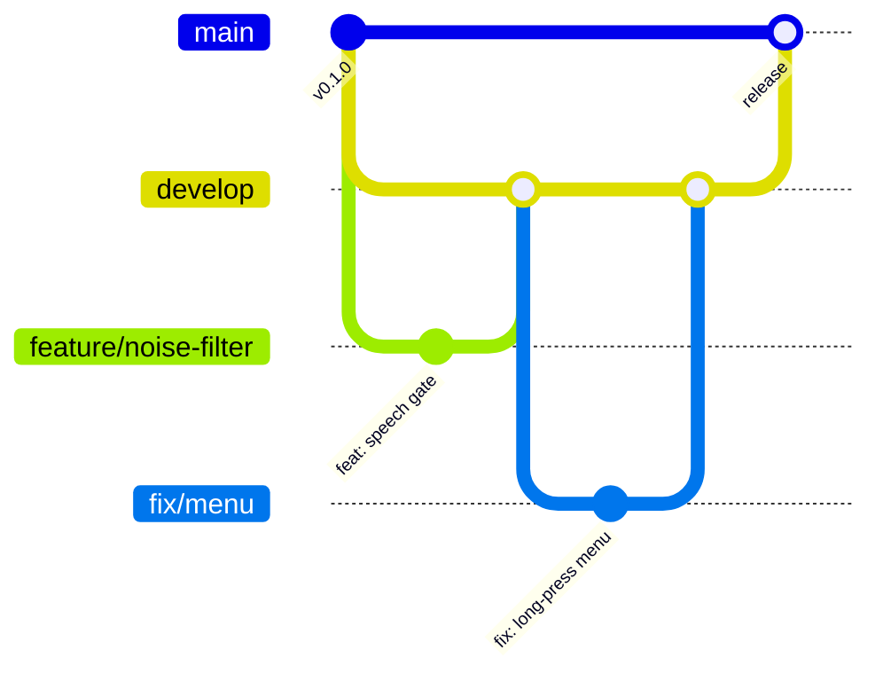

# Contributing to Tonarin

Thanks for helping! This page covers how branches, commits and pull requests work here.

## Branch model



| Branch | Purpose | How changes get in |
|---|---|---|
| `main` | Released, always buildable | **Pull request from `develop` only.** Direct pushes are blocked for everyone, admins included |
| `develop` | Integration of finished work | Pull request from a topic branch (CI must pass) |
| `feature/<topic>` | New features | Branch off `develop` |
| `fix/<topic>` | Bug fixes | Branch off `develop` |
| `docs/<topic>`, `chore/<topic>` | Docs, tooling, dependencies | Branch off `develop` |
| `hotfix/<topic>` | Urgent fix for a release | Branch off `main`, PR into `main`, then merge `main` back into `develop` |

GitHub enforces this with branch protection: pull requests are required on `main` and `develop`, CI (`Node 22.x`,
`Node 24.x`) must pass, force pushes and branch deletion are off.

You can catch a mistaken push before it leaves your machine:

```bash
npm run hooks   # once per clone: uses .githooks/, whose pre-push refuses pushes to main
```

## Workflow

```bash
git switch develop && git pull
git switch -c feature/short-description
# … work, commit …
npm run typecheck && npm test
git push -u origin feature/short-description
gh pr create --base develop
```

Releases: open a pull request from `develop` into `main`, titled `release: vX.Y.Z`.

## Commit messages

[Conventional Commits](https://www.conventionalcommits.org/):

```text
<type>(<optional scope>): <summary in the imperative, lower case, no period>
```

| Type | Use for |
|---|---|
| `feat` | A new feature |
| `fix` | A bug fix |
| `docs` | Documentation only |
| `refactor` | Code change that neither fixes a bug nor adds a feature |
| `test` | Tests only |
| `build` / `ci` | Build scripts, packaging, CI |
| `chore` | Maintenance (dependencies, tooling) |

Examples: `feat(pet): open the menu on press-and-hold`, `fix(live): keep the resumption handle after goAway`.

## Before you open a pull request

- `npm run typecheck` and `npm test` pass.
- If behavior changed, you tried it with `npm run pet`.
- User-facing text is in both Japanese and English (`pet/ui/i18n.js`, `pet/i18n.cjs`).
- The security design holds: the proxy stays on `127.0.0.1` with its key, Copilot keeps only Tonarin's custom
  tools, untrusted content stays labeled as data, and nothing logs transcripts or audio.

## Never commit

- `.env` files, API keys, tokens, `.npmrc` with credentials, certificates or signing identities
- Logs, recordings, transcripts, or anything from `~/Library/Application Support/Tonarin/`
- Third-party artwork, including Codex / ChatGPT pets. Characters in this repository must be original.

`.gitignore` covers the common cases, CI fails if such files are tracked, and GitHub secret scanning with push
protection is on. If a secret does get pushed, revoke it first, then clean the history.
