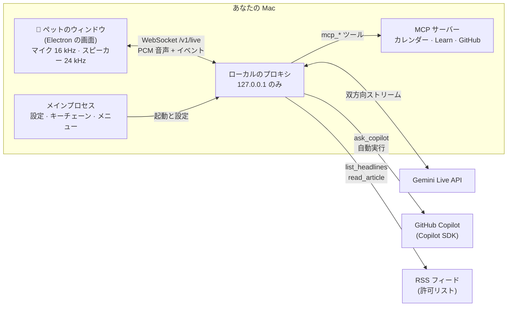

<div align="center">


# Tonarin (となりん)

**となりにいる相棒。** リアルタイムで話せて、じっくり考える仕事は GitHub Copilot に任せる、<br/>
macOS のデスクトップに住む音声コンパニオンです。

[](https://github.com/himiyosh/tonarin/actions/workflows/ci.yml)


[](LICENSE)

[English](README.md) | 日本語

</div>

---

Tonarin は、デスクトップに住む小さなキャラクターです。となりの席の同僚に話しかけるように声をかけると、
**Gemini Live** で 1 秒ほどで返事をします。記事の中身、設計の相談、コードの仕組みのように考える必要がある質問は、
あなたがすでに使っている **GitHub Copilot** に聞いて、その答えを自分の言葉で話してくれます。

## 目次

- [Tonarin の特長](#tonarin-の特長)
- [機能](#機能)
- [はじめかた](#はじめかた)
- [使いかた](#使いかた)
- [しくみ](#しくみ)
- [プライバシーとセキュリティ](#プライバシーとセキュリティ)
- [料金](#料金)
- [設定](#設定)
- [開発](#開発)
- [コントリビュート](#コントリビュート)
- [制限事項](#制限事項)
- [ライセンス](#ライセンス)

## Tonarin の特長

| | |
|---|---|
| 🗣️ **リアルタイムの会話** | 自然に話しかけて、いつでも割り込めます。最初の声はたいてい 1 秒ほどで返ってきます。 |
| 🧠 **Copilot が頭脳** | 深掘りは公式の SDK 経由で GitHub Copilot に。いま契約している Copilot のプランをそのまま使います。 |
| 🐾 **デスクに住む** | チャットの窓ではなく、吹き出しで話す常に手前の小さなキャラクターです。 |
| 🔒 **プライバシー重視の設計** | キーは macOS のキーチェーンに保存し、ローカルのプロキシは 127.0.0.1 だけで待ち受け、話した内容はログに残しません。 |

## 機能

| 分野 | できること |
|---|---|
| **会話** | Gemini Live でのリアルタイム音声会話、割り込み、双方の字幕、日本語と英語 (画面の言語と話す言語は別々に設定)。 |
| **Copilot で深掘り** | 記事の中身、比較、解説、設計の相談を `ask_copilot` で、隔離した Copilot セッションに任せます。 |
| **テックニュース** | 厳選した 12 の RSS フィード (日本語と英語) から見出しを紹介し、詳しく知りたいときは Copilot が記事を読みます。 |
| **リマインダーと自動実行** | 「20 分後に教えて」、朝のブリーフィング、Copilot の定期調査、休憩の声かけ、キーワード監視。履歴も残ります。 |
| **アプリ連携 (MCP)** | Model Context Protocol のサーバーがペットの道具になります。Mac のカレンダー (Google、iCloud、Exchange)、Microsoft Learn、GitHub (読み取り専用、**GitHub でサインイン**)。 |
| **雑音フィルター** | 声らしい音だけを Gemini に送るので、タイピングやファン、ドアの音で会話が始まりません。強さは 3 段階。 |
| **使用量と料金** | 有料枠で何に料金がかかるか、今日の使用量、料金の目安を設定画面で確認できます。 |
| **キャラクター** | オリジナルのキャラクター 8 体、大きさは 50〜200%、Codex / ChatGPT のペット (スプライトシート) にも対応。 |
| **Mac らしさ** | メニューバーのアイコン、macOS 26 の Liquid Glass アイコン、画面ロックでおやすみ、吹き出しはペットの空いている側に表示。 |

## はじめかた

### 必要なもの

| | |
|---|---|
| **Mac** | Apple Silicon。macOS 26 で開発と動作確認をしています。 |
| **Gemini API キー** | [Google AI Studio](https://aistudio.google.com/apikey) で無料で作れます。無料枠でも使えます ([料金](#料金)を参照)。 |
| **GitHub Copilot** *(任意)* | どのプランでも可。[Copilot CLI](https://github.com/github/copilot-cli) で一度サインインするか、`COPILOT_GITHUB_TOKEN` を設定します。なくても会話はでき、深掘りだけが使えません。 |
| **Node.js** | 22.12 以上 (ソースからビルドする場合)。 |

### ビルドと起動

```bash
git clone https://github.com/himiyosh/tonarin.git
cd tonarin
npm install
npm run pet          # ソースから起動
# または
npm run dist         # release/Tonarin-<version>-arm64.dmg を作る
```

初めて起動すると、設定画面の「接続」が開きます。Gemini API キーを貼り付けると、ペットが起きます。

> [!NOTE]
> Developer ID の署名を用意するまでは、アドホック署名のビルドです。初回は右クリック →「開く」で開いてください。
> マイクへのアクセスを確認され、初めてカレンダーを読むときはカレンダーへのアクセスも確認されます。

## 使いかた

| 操作 | 動作 |
|---|---|
| **話しかける** | そのまま話すだけ。なんでも聞けますし、「今日のテックニュースは？」も。 |
| **クリック** | マイクのミュート / 解除 (ミュート中はマイク自体を閉じるので、macOS のマイク表示も消えます)。寝ているときは起こします。 |
| **ドラッグ** | ペットを好きな場所へ。画面の一番上まで置けます。 |
| **右クリック**、**Control + クリック**、**長押し** | メニュー: おやすみ、ミュート、キャラクター、サイズ、会話のリセット、設定、終了。 |
| **ピンチ** (または Control + スクロール) | ペットの大きさを変える。 |

話しかけてみる例:

- 「30 分後にストレッチするよう教えて」
- 「今日の午後の予定は？」
- 「今日のニュースから AI の話を 1 つ選んで、開発者にとってどういう意味か Copilot に聞いて」
- 「Azure Functions のタイムアウトの既定値を Microsoft Learn で調べて」

会話がないまま 10 分たつと (時間は変更可能)、また画面をロックすると、ペットは寝ます。クリックするまでマイクと接続は閉じたままです。

## しくみ



- **ペットのウィンドウ** (`pet/ui/`): マイクの取り込み、[雑音フィルター](pet/ui/speech-gate.js)、音声の再生、キャラクターと吹き出しの表示。
- **メインプロセス** (`pet/main.cjs`): 設定、キーチェーン、メニューバー、ウィンドウの配置、GitHub でサインイン、同梱プロキシの起動と停止。
- **プロキシ** (`src/`): Gemini Live との音声の中継、ツール (ニュース、リマインダー、自動実行、MCP) の実行、深掘り用の Copilot セッション。
  OpenAI 互換のエンドポイントでもあり、プロジェクトはここから始まりました ([設定リファレンス](docs/configuration.md#openai-compatible-endpoint)を参照)。

## プライバシーとセキュリティ

- **キーは手元だけに。** Gemini のキー、MCP のトークン、GitHub のサインインは Electron の `safeStorage` (macOS のキーチェーン) で暗号化して保存し、画面側には渡しません。
- **ローカル専用のプロキシ。** `127.0.0.1` だけで待ち受け、Bearer キーが必要で、Web ページからの WebSocket 接続は拒否します。
- **Copilot は隔離。** 使えるのは Tonarin の読み取り専用ツールだけです。シェル、ファイル編集、URL 取得などの組み込みツールは無効、作業フォルダは空の一時フォルダ、Copilot Memory はオフです。
- **外から来た内容はデータとして扱う。** ニュース記事と MCP の結果は「指示ではなくデータ」と明示し、長さを制限します。記事は許可したホストからしか取得しません。
- **変更の前には確認。** アプリ連携のうち、作成・変更・削除をするツールは最初はオフで、使う前にペットがあなたに確認します。
- **話した内容はログに残しません。** ログにはアプリのイベントとトークン数だけで、文字起こしや音声は含みません。
- **GitHub でサインイン** は OAuth のデバイスフローで、公開用の Client ID だけを使い、client secret はありません。トークンは 8 時間で切れ、自動で更新します。アクセスは読み取り専用です。

> [!IMPORTANT]
> Gemini の**無料枠**では、送った内容が Google の製品改善に使われ、人間のレビュアーが読む場合があります。
> 会話やつないだアプリに機密情報や個人情報を含めないか、有料枠を使ってください。

脆弱性の報告は [SECURITY.md](SECURITY.md) を参照してください。

## 料金

| | 無料枠 | 有料枠 |
|---|---|---|
| **Gemini Live** | 料金はかかりません。上限に達するとエラーで止まります。 | トークン単位で課金。短いやり取り 1 回で約 **$0.003**。 |
| **Copilot** | Copilot のプランの AI Credits を使います。ペットが Copilot に聞いたときと、Copilot 担当の自動実行のときだけです。 | 同じ |

有料枠で料金がかかるものと、Tonarin の抑えかた:

- やり取りのたびに、それまでの会話全体が数え直されます。そのため会話の記憶は 25K トークンで縮めます。
- Gemini 3.8 Live では、聞いている時間も課金されることがあります。雑音フィルターは話している間だけ音声を送り、ミュートはマイクを閉じ、おやすみと画面ロックでは接続を切ります。
- **設定 → 使用量と料金** で、今日の使用量と料金の目安 (下限〜上限) を確認できます。実際の請求は AI Studio で確認してください。

## 設定

ふだん必要なものは、すべて設定画面にあります (メニューバーのアイコン、右クリック →「設定…」、または <kbd>⌘</kbd> <kbd>,</kbd>)。
一般、キャラクター、会話と声、自動実行、アプリ連携、ニュース、接続、使用量と料金などの画面があり、
設定は `~/Library/Application Support/Tonarin/` に保存されます。

開発用やプロキシ単体で使うときの環境変数は [docs/configuration.md](docs/configuration.md) にまとめています。

## 開発

| コマンド | 内容 |
|---|---|
| `npm run pet` | ソースからペットを起動 (プロキシは `tsx` で起動) |
| `npm run pet:bundled` | 配布版と同じく、まとめたプロキシで起動 |
| `npm run dist` | `.app`、`.zip`、`.dmg` を `release/` に作る |
| `npm run typecheck` | TypeScript の型チェック |
| `npm test` | ユニットテスト (`node:test`) |
| `npm run live:check -- "話しかける内容"` | マイクなしで Gemini Live を試す |
| `npm run icon` | Liquid Glass アイコンを作り直す (Xcode 26 以上が必要) |
| `npm run hooks` | リポジトリの Git フックを有効にする (`main` への直接 push を止める) |

```text
tonarin/
├── pet/            Electron アプリ: メインプロセス、preload、設定、配置、GitHub サインイン
│   └── ui/         ペットと設定の画面、音声 worklet、雑音フィルター、キャラクター
├── src/            ローカルのプロキシ: Gemini Live の中継、Copilot、ニュース、リマインダー、自動実行、MCP、使用量
├── scripts/        ビルド、パッケージ、アイコン、動作確認のスクリプト
├── assets/ build/  アプリとメニューバーのアイコン、Liquid Glass アイコン、entitlements、Info.plist の文言
├── tests/          ユニットテスト
└── docs/           設定リファレンス
```

## コントリビュート

歓迎します。`main` は `develop` からのプルリクエストだけを受け付け、日々の作業は feature ブランチから `develop` に入れます。
ブランチの運用、コミットの書き方、チェックリストは [CONTRIBUTING.md](CONTRIBUTING.md) を参照してください。

## 制限事項

- いまは Apple Silicon の macOS だけに対応しています。
- まだ公証 (notarization) していません (Developer ID が必要です)。
- macOS 26 の一部のトラックパッドでは、普通のクリックの直後の 2 本指クリックが、どのアプリでも左クリックとして届くことがあります。そのときは長押しか Control + クリックでメニューを開いてください。
- Gemini Live のセッションには寿命があります。Tonarin はできる限り引き継ぎますが、おやすみの後は新しい会話から始まります。

## ライセンス

[MIT](LICENSE) © himiyosh

`pet/ui/characters/` のキャラクターは、このプロジェクトのために作ったオリジナルです。Codex / ChatGPT のペットは、あなたの `~/.codex/pets` フォルダから読むだけで、アプリやこのリポジトリにコピーすることはありません。
