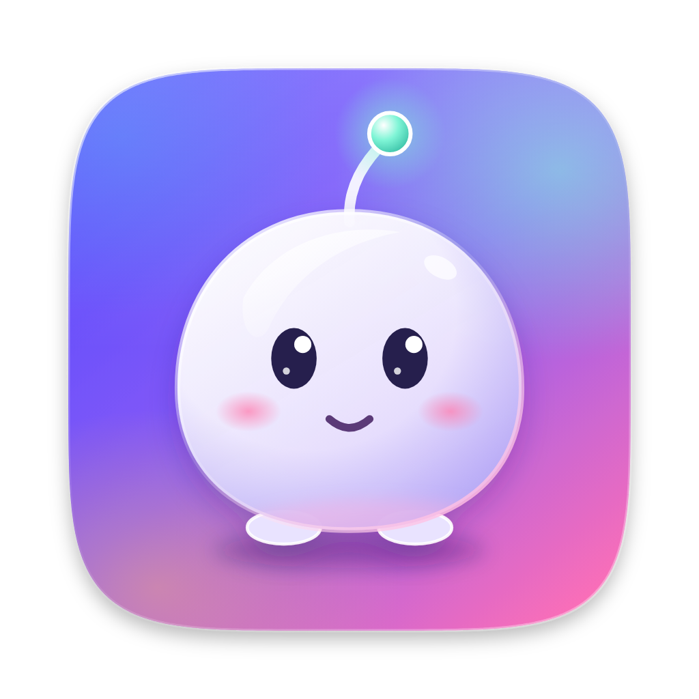
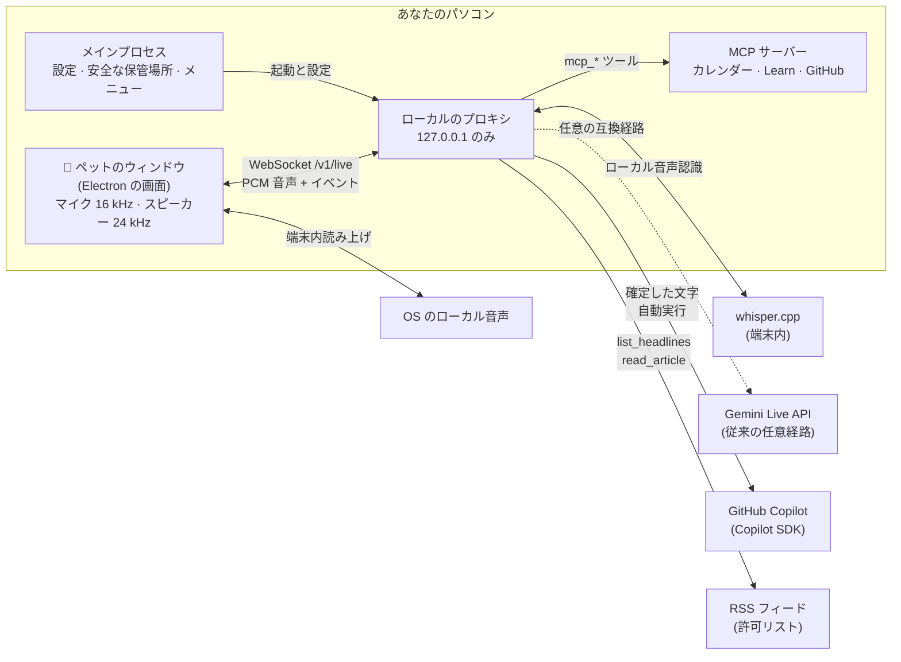

<div align="center">



# Tonarin (となりん)

**となりにいる相棒。** リアルタイムで話せて、じっくり考える仕事は GitHub Copilot に任せる、<br/>
macOS と Windows のデスクトップに住む音声コンパニオンです。

**[ダウンロード](https://himiyosh.github.io/tonarin/?lang=ja)** · [リリースノート](https://github.com/himiyosh/tonarin/releases)

[](https://github.com/himiyosh/tonarin/actions/workflows/ci.yml)
[](https://github.com/himiyosh/tonarin/releases/latest)

-0078D4?logo=windows&logoColor=white)


[](LICENSE)

[English](README.md) | 日本語

</div>

---

Tonarin は、デスクトップに住む小さなキャラクターです。ローカルの whisper.cpp で声を文字にし、
確定した文字だけを **GitHub Copilot** に送って、OS にインストール済みの声で返事を読み上げます。
音声データは端末の外へ送りません。従来の Gemini Live 経路も互換用に残しています。

## 目次

- [Tonarin の特長](#tonarin-の特長)
- [機能](#機能)
- [はじめかた](#はじめかた)
- [使いかた](#使いかた)
- [しくみ](#しくみ)
- [プライバシーとセキュリティ](#プライバシーとセキュリティ)
- [料金](#料金)
- [設定](#設定)
- [開発](#開発)
- [コントリビュート](#コントリビュート)
- [制限事項](#制限事項)
- [ライセンス](#ライセンス)

## Tonarin の特長

| | |
|---|---|
| 🗣️ **リアルタイムの会話** | 自然に話しかけて、いつでも割り込めます。最初の声はたいてい 1 秒ほどで返ってきます。 |
| 🧠 **Copilot が頭脳** | 深掘りは公式の SDK 経由で GitHub Copilot に。いま契約している Copilot のプランをそのまま使います。 |
| 🐾 **デスクに住む** | チャットの窓ではなく、吹き出しで話す常に手前の小さなキャラクターです。 |
| 🔒 **プライバシー重視の設計** | キーは OS の保護機能を使って暗号化して保存し、ローカルのプロキシは 127.0.0.1 だけで待ち受け、話した内容はログに残しません。 |

## 機能

| 分野 | できること |
|---|---|
| **会話** | ローカル音声認識、GitHub Copilot の応答、端末内読み上げ、割り込み、双方の字幕、日本語と英語。従来の Gemini Live 経路も利用できます。 |
| **Copilot で深掘り** | 記事の中身、比較、解説、設計の相談を `ask_copilot` で、隔離した Copilot セッションに任せます。 |
| **ニュース** | 従来の日英テック系 12 フィードは標準のまま、日本語の行政・総合 2 件と、英語の総合・経済・科学・暮らし（健康）の確認済み公開 RSS/Atom を任意選択できます。公開フィードのある HTTPS サイトも登録でき、許可されたホストの記事を読みます。 |
| **メール模擬 (MOCK/DEMO)** | 初期オフ。架空の Gmail 型・Outlook 型の認可、差出人・件名の通知、端末内の読み上げを試せます。実ログイン、実メール取得、AI 転送はありません。 |
| **リマインダーと自動実行** | 「20 分後に教えて」、朝のまとめ、Copilot による定期調査、休憩の声かけ、キーワード通知。履歴も残ります。 |
| **アプリ連携 (MCP)** | Model Context Protocol のサーバーがペットの道具になります。Mac のカレンダー (Google、iCloud、Exchange。macOS のみ)、Microsoft Learn、GitHub (読み取り専用、**GitHub でサインイン**)。 |
| **雑音フィルター** | 声らしい音だけを認識するので、タイピングやファン、ドアの音で会話が始まりません。強さは 3 段階。 |
| **使用量と料金** | 有料枠で何に料金がかかるか、今日の使用量、料金の目安を設定で確認できます。 |
| **キャラクター** | オリジナルのキャラクター 8 体、大きさは 50〜200%、Codex / ChatGPT のペット (スプライトシート) にも対応。 |
| **Mac らしさ** | メニューバーのアイコン、macOS 26 の Liquid Glass アイコン、画面ロックでおやすみ、吹き出しはペットの空いている側に表示。 |
| **Windows（プレビュー）** | 通知領域のアイコン（左クリックでメニューを開けます）、管理者権限なしで使えるインストーラー、DPAPI によるキーの暗号化、二重起動時には起動済みのペットを表示します。 |

## はじめかた

### 必要なもの

| | |
|---|---|
| **パソコン** | Apple Silicon の Mac (macOS 26 で開発と動作確認をしています)、または Windows 10 / 11 の PC (x64 か ARM64、プレビュー)。 |
| **ローカル音声認識** | `whisper-server` とローカルモデル。セットアップは [設定リファレンス](docs/configuration.md#realtime-voice) を参照。 |
| **GitHub Copilot** | どのプランでも可。[Copilot CLI](https://github.com/github/copilot-cli) で一度サインインするか、`COPILOT_GITHUB_TOKEN` を設定します。 |
| **Gemini API キー** *(任意)* | ローカル音声認識を使わず、従来の Gemini Live 経路を使う場合だけ必要です。 |
| **Node.js** | 22.12 以上 (ソースからビルドする場合だけ)。 |

### ダウンロード

**[ダウンロードページ](https://himiyosh.github.io/tonarin/?lang=ja)** から、お使いのパソコンに合ったファイルをダウンロードできます。
[GitHub の Releases](https://github.com/himiyosh/tonarin/releases) からも入手できます。Mac 用は
`Tonarin-<version>-mac-arm64.dmg` (または `.zip`)、Windows 用は `Tonarin-<version>-win-x64-setup.exe` か
`-win-arm64-setup.exe` です。各リリースの `SHA256SUMS.txt` に SHA-256 のチェックサムがあります。

初回起動時は「設定」の「接続」が開きます。ローカル音声認識を準備すると Gemini なしで起動できます。

> [!NOTE]
> アプリはまだ Apple の公証も Windows のコード署名も受けていないため、最初の一度だけ確認が出ます。
> - **macOS**: 初回に止められたら、「システム設定」→「プライバシーとセキュリティ」で「このまま開く」をクリックします
>   (macOS 14 以前は、アプリを右クリック →「開く」)。続いてマイクへのアクセスを確認され、初めてカレンダーを読むときは
>   カレンダーへのアクセスも確認されます。
> - **Windows**: SmartScreen で「Windows によって PC が保護されました」と表示されたら、「詳細情報」→「実行」を選びます。
>   インストールはあなたのアカウントにだけ行われます。マイクが使えないときは、「設定」→「プライバシーとセキュリティ」→
>   「マイク」で「デスクトップ アプリがマイクにアクセスできるようにする」をオンにしてください。

### ソースからビルド

```bash
git clone https://github.com/himiyosh/tonarin.git
cd tonarin
npm install
npm run pet          # ソースから起動
# または
npm run dist         # このパソコン用のアプリを release/ に作る
```

`npm run dist` は、Mac では `Tonarin-<version>-mac-arm64.dmg` と `.zip`、Windows では
`Tonarin-<version>-win-<arch>-setup.exe` を作ります。npm は実行している OS 用の Copilot ランタイムしか入れないため、
各 OS のアプリはその OS の上でビルドしてください。

## 使いかた

| 操作 | 動作 |
|---|---|
| **話しかける** | そのまま話すだけ。なんでも聞けますし、「今日のテックニュースは？」も。 |
| **クリック** | マイクのミュート / 解除 (ミュート中はマイク自体を閉じるので、OS のマイク表示も消えます)。寝ているときは起こします。 |
| **ドラッグ** | ペットを好きな場所へ。画面の一番上まで置けます。 |
| **右クリック**、**Control + クリック**（Mac）、**長押し** | メニュー：おやすみ、ミュート、キャラクター、大きさ、会話をリセット、設定、終了。 |
| **ピンチ** (または Control + スクロール、Windows では Ctrl + スクロール) | ペットの大きさを変える。 |
| **メニューバーのアイコン** (Mac) / **通知領域のアイコン** (Windows) | ペットの表示と非表示、おやすみ、ミュート、設定、終了。Windows では左クリックでも開きます。 |

話しかけてみる例:

- 「30 分後にストレッチするよう教えて」
- 「今日の午後の予定は？」
- 「今日のニュースから AI の話を 1 つ選んで、開発者にとってどういう意味か Copilot に聞いて」
- 「Azure Functions のタイムアウトの既定値を Microsoft Learn で調べて」

会話がないまま 10 分たつと (時間は変更可能)、また画面をロックすると、ペットは寝ます。クリックするまでマイクと接続は閉じたままです。

## しくみ



- **ペットのウィンドウ** (`pet/ui/`): マイクの取り込み、[雑音フィルター](pet/ui/speech-gate.js)、音声の再生、キャラクターと吹き出しの表示。
- **メインプロセス** (`pet/main.cjs`): 設定、安全な保管場所、メニューバーや通知領域のアイコン、ウィンドウの配置、GitHub でサインイン、同梱プロキシの起動と停止。
- **プロキシ** (`src/`): ローカル音声認識と Copilot 会話の調整、ツール (ニュース、リマインダー、自動実行、MCP) の実行、従来の Gemini Live 経路。
  OpenAI 互換のエンドポイントでもあり、プロジェクトはここから始まりました ([設定リファレンス](docs/configuration.md#openai-compatible-endpoint)を参照)。

## プライバシーとセキュリティ

- **ローカル経路の音声は外へ送りません。** whisper.cpp が端末内で認識し、確定した文字と会話コンテキストだけを GitHub Copilot に送ります。読み上げも OS のローカル音声です。
- **キーは手元だけに。** 任意の Gemini キー、MCP のトークン、GitHub のサインインは Electron の `safeStorage` (macOS のキーチェーン、Windows では DPAPI) で暗号化して保存し、画面側には渡しません。
- **ローカル専用のプロキシ。** `127.0.0.1` だけで待ち受け、Bearer キーが必要で、Web ページからの WebSocket 接続は拒否します。
- **Copilot は隔離。** 使えるのは Tonarin の読み取り専用ツールだけです。シェル、ファイル編集、URL 取得などの組み込みツールは無効、作業フォルダは空の一時フォルダ、Copilot Memory はオフです。
- **外から来た内容はデータとして扱う。** ニュース記事と MCP の結果は「指示ではなくデータ」と明示し、長さを制限します。記事は許可したホストからしか取得しません。
- **変更の前には確認。** アプリ連携のうち、作成・変更・削除をするツールは最初はオフで、使う前にペットがあなたに確認します。
- **話した内容はログに残しません。** ログにはアプリのイベントとトークン数だけで、文字起こしや音声は含みません。
- **GitHub でサインイン** は OAuth のデバイスフローで、公開用の Client ID だけを使い、client secret はありません。トークンは 8 時間で切れ、自動で更新します。アクセスは読み取り専用です。

> [!IMPORTANT]
> 従来の Gemini 経路を選ぶ場合、Gemini の**無料枠**では、送った内容が Google の製品改善に使われ、人間のレビュアーが読む場合があります。
> 会話やつないだアプリに機密情報や個人情報を含めないか、有料枠を使ってください。

脆弱性の報告は [SECURITY.md](SECURITY.md) を参照してください。

## 料金

| | 無料枠 | 有料枠 |
|---|---|---|
| **Gemini Live** | 料金はかかりません。上限に達するとエラーで止まります。 | トークン単位で課金。短いやり取り 1 回で約 **$0.003**。 |
| **Copilot** | Copilot のプランの AI Credits を使います。ペットが Copilot に聞いたときと、Copilot 担当の自動実行のときだけです。 | 同じ |

有料枠で料金がかかるものと、Tonarin の抑えかた:

- やり取りのたびに、それまでの会話全体が数え直されます。そのため会話の記憶は 25K トークンで縮めます。
- Gemini 3.8 Live では、聞いている時間も課金されることがあります。雑音フィルターは話している間だけ音声を送り、ミュートはマイクを閉じ、おやすみと画面ロックでは接続を切ります。
- **設定 → 使用量と料金** で、今日の使用量と料金の目安 (下限〜上限) を確認できます。実際の請求は AI Studio で確認してください。

## 設定

設定は、メニューバー（Mac）または通知領域（Windows）のアイコン、ペットの右クリックメニューの「設定…」から開けます。Mac では <kbd>⌘</kbd> <kbd>,</kbd> も使えます。
一般、キャラクター、会話と声、自動実行、アプリ連携、ニュース、接続、使用量と料金などの画面があり、
設定は Mac では `~/Library/Application Support/Tonarin/`、Windows では `%APPDATA%\Tonarin\` に保存されます。

**設定 → メール模擬 (MOCK)** は架空のデータだけを使います。本文表示のオンと、AI 転送の別の確認を
試せますが、実メールを読んだり、本文を AI に送ったり、要約を作ったりはしません。
[模擬メールの制限](docs/configuration.md#mail-prototype-mockdemo)をご覧ください。

**設定 → ニュース**では分野や取得元を個別に選択し、HTTPS のサイト URL または RSS/Atom URL を追加できます。
公開フィードを見つけられないサイトは追加しません。以前の選択は維持し、新しい組込分野は任意選択です。
追加したサイトで本文を読めるのは**入力した正確なホストだけ**で、別のフィードホストや記事ホストには権限を広げません。
現在、テック系以外の日本語組込取得元は行政・総合のみです。経済・科学・暮らしは、条件を確認した公開 RSS/Atom を自分で追加できます。
[ニュース設定と取得元の説明](docs/configuration.md#news-sources)も参照してください。

開発用やプロキシ単体で使うときの環境変数は [docs/configuration.md](docs/configuration.md) にまとめています。

## 開発

| コマンド | 内容 |
|---|---|
| `npm run pet` | ソースからペットを起動 (プロキシは `tsx` で起動) |
| `npm run pet:bundled` | 配布版と同じく、まとめたプロキシで起動 |
| `npm run dist` | このパソコン用のアプリを `release/` に作る (Mac では `.dmg` と `.zip`、Windows ではインストーラー) |
| `npm run smoke` | パッケージしたアプリを一時的な設定フォルダーで一度起動し、動くことを確かめる |
| `npm run site` | ダウンロードページを `_site/` に作る (`-- --fixture tests/fixtures/releases.json --serve` で試せます) |
| `npm run release-notes -- vX.Y.Z` | `docs/releases/` からリリースの本文をプレビュー |
| `npm run typecheck` | TypeScript の型チェック |
| `npm test` | ユニットテスト (`node:test`) |
| `npm run live:check -- "話しかける内容"` | マイクなしで Gemini Live を試す |
| `npm run icon` | Liquid Glass アイコンを作り直す (Xcode 26 以上が必要) |
| `npm run icon:derive` | アプリのアイコンから Windows 用アイコンとダウンロードページの画像を作り直す (Pillow が必要) |
| `npm run hooks` | リポジトリの Git フックを有効にする (`main` への直接 push を止める) |

```text
tonarin/
├── pet/            Electron アプリ: メインプロセス、preload、設定、配置、GitHub サインイン
│   └── ui/         ペットと設定の画面、音声 worklet、雑音フィルター、キャラクター
├── src/            ローカルのプロキシ: Gemini Live の中継、Copilot、ニュース、リマインダー、自動実行、MCP、使用量
├── scripts/        ビルド、パッケージ、アイコン、動作確認、リリースノート、ダウンロードページのスクリプト
├── assets/ build/  アプリとメニューバー / 通知領域のアイコン、Liquid Glass アイコン、entitlements、Info.plist の文言
├── site/           ダウンロードページ (GitHub Pages)
├── tests/          ユニットテスト
└── docs/           設定リファレンス、リリースノート (docs/releases/)
```

## コントリビュート

歓迎します。`main` は `develop` からのプルリクエストだけを受け付け、日々の作業は feature ブランチから `develop` に入れます。
ブランチの運用、コミットの書き方、チェックリストは [CONTRIBUTING.md](CONTRIBUTING.md)、リリースの作りかたは
[docs/releases/](docs/releases/README.md) を参照してください。

## 制限事項

- いまは Apple Silicon の macOS と Windows 10 / 11 に対応しています。Windows はプレビューです。Intel の Mac と Linux 版はまだありません。
- macOS の公証 (notarization) はまだです (Developer ID が必要です)。Windows のコード署名もまだです。
- 「Mac のカレンダー」のプリセットと、OpenAI 互換の `/v1/audio/speech` (macOS の `say`) は macOS だけで使えます。
- macOS 26 の一部のトラックパッドでは、普通のクリックの直後の 2 本指クリックが、どのアプリでも左クリックとして届くことがあります。そのときは長押しか Control + クリックでメニューを開いてください。
- Gemini Live のセッションには寿命があります。Tonarin はできる限り引き継ぎますが、おやすみの後は新しい会話から始まります。

## ライセンス

[MIT](LICENSE) © himiyosh

`pet/ui/characters/` のキャラクターは、このプロジェクトのために作ったオリジナルです。Codex / ChatGPT のペットは、あなたの `~/.codex/pets` フォルダから読むだけで、アプリやこのリポジトリにコピーすることはありません。
