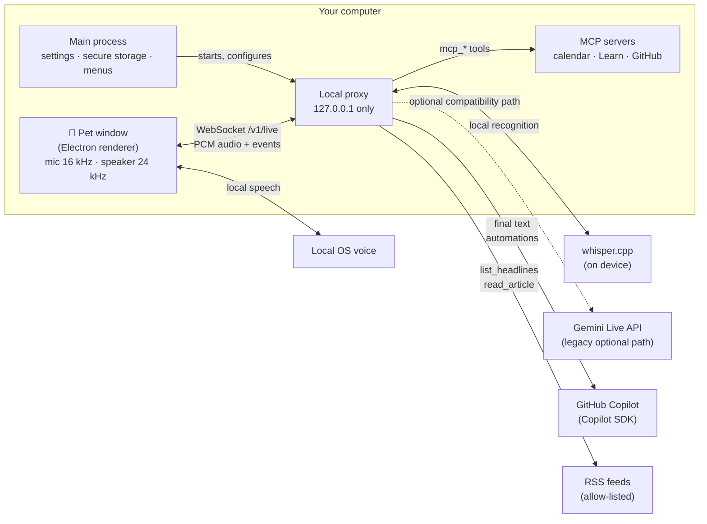

<div align="center">


# Tonarin

**The one next to you.** A voice desk companion for Apple Silicon Macs and Windows 10/11 x64/ARM64 (preview)<br/>
that talks with you in real time and hands the careful thinking to GitHub Copilot.

**[Download](https://himiyosh.github.io/tonarin/)** · [Release notes](https://github.com/himiyosh/tonarin/releases)

[](https://github.com/himiyosh/tonarin/actions/workflows/ci.yml)
[](https://github.com/himiyosh/tonarin/releases/latest)

-0078D4?logo=windows&logoColor=white)


[](LICENSE)

English | [日本語](README.ja.md)

</div>

---

Tonarin (となりん, "the one next to you") is a small character that lives on your desktop. Local whisper.cpp turns
your speech into text, only final text goes to **GitHub Copilot**, and an installed OS voice reads the answer aloud.
Audio stays on the computer. The previous Gemini Live path remains available for compatibility.

## Contents

- [Why Tonarin](#why-tonarin)
- [Features](#features)
- [Quick start](#quick-start)
- [Using Tonarin](#using-tonarin)
- [How it works](#how-it-works)
- [Privacy and security](#privacy-and-security)
- [Costs](#costs)
- [Configuration](#configuration)
- [Development](#development)
- [Contributing](#contributing)
- [Limitations](#limitations)
- [License](#license)

## Why Tonarin

| | |
|---|---|
| 🗣️ **Real-time voice** | Speak naturally and interrupt at any time. First audio usually arrives in about 1 second. |
| 🧠 **Copilot as the brain** | Deep dives go to GitHub Copilot through the official SDK, using the Copilot plan you already pay for. |
| 🐾 **Lives on your desk** | A small, always-on-top character with a speech bubble, not another chat window. |
| 🔒 **Private by design** | Keys stay in your system's secure storage, the local proxy only listens on 127.0.0.1, and nothing you say is logged. |

## Features

| Area | What you get |
|---|---|
| **Conversation** | Local speech recognition, GitHub Copilot replies, local system speech, barge-in and captions in Japanese and English. Local candidates are transcribed before they can interrupt an active Copilot reply; common silence hallucinations are ignored. The legacy Gemini Live path remains available. |
| **Copilot deep dives** | `ask_copilot` hands articles, comparisons, explanations and design questions to a sandboxed Copilot session. |
| **News** | Uses the original 12 Japanese/English technology feeds for the active speech language. Publisher-restricted sources provide headlines and descriptions only. |
| **Reminders and automations** | "Remind me in 20 minutes", a morning briefing, scheduled Copilot research, break nudges and keyword watch, with a history you can review. |
| **Connected apps (MCP)** | Model Context Protocol servers become the pet's tools: your Mac's calendar (Google, iCloud, Exchange; macOS), Microsoft Learn, and GitHub (read-only, with **Sign in with GitHub**). |
| **Noise filter** | Only voice-like sound is recognized, so typing, fans or a door do not start a conversation. Three levels. |
| **Usage and cost** | A settings page that shows what the paid tier would bill, today's usage and an estimate. |
| **Characters** | 8 original characters, sizes from 50% to 200%, and support for Codex / ChatGPT pet spritesheets. |
| **Mac-native touches** | Menu bar icon, Liquid Glass app icon on macOS 26, sleeps with your screen lock, and the bubble opens on whichever side of the pet has room. |
| **Windows (preview)** | A notification-area icon (a left click opens the menu), an installer for your account without admin rights, keys encrypted with DPAPI, and starting it again brings back the running pet. |

## Quick start

### Requirements

| | |
|---|---|
| **Computer** | A Mac with Apple Silicon (developed and tested on macOS 26), or a Windows 10 / 11 PC, x64 or ARM64 (preview). |
| **Local speech recognition** | `whisper-server` and a local model. See [Configuration](docs/configuration.md#realtime-voice). |
| **GitHub Copilot** | Any plan. Sign in once with the [Copilot CLI](https://github.com/github/copilot-cli), which Tonarin auto-detects on macOS, or set `COPILOT_GITHUB_TOKEN`. |
| **Gemini API key** *(optional)* | Needed only for the legacy Gemini Live path when local recognition is unavailable. |
| **Node.js** | 22.12 or later, only to build from source. |

### Download

Get the app from the **[download page](https://himiyosh.github.io/tonarin/)**, which picks the right file for your
computer, or from [GitHub Releases](https://github.com/himiyosh/tonarin/releases): `Tonarin-<version>-mac-arm64.dmg`
(or `.zip`) for a Mac, `Tonarin-<version>-win-x64-setup.exe` or `-win-arm64-setup.exe` for Windows. Each release lists
SHA-256 checksums in `SHA256SUMS.txt`.

On first launch **Connection** explains local speech setup. Once it is ready, the pet works without Gemini.

> [!NOTE]
> The apps are not notarized by Apple or code signed for Windows yet, so each system asks once:
> - **macOS**: when Tonarin is blocked the first time, open System Settings → Privacy & Security and click
>   **Open Anyway** (on macOS 14 and earlier, right-click the app → **Open**). macOS then asks for microphone access,
>   and the first time the pet reads your calendar it asks for calendar access too.
> - **Windows**: if SmartScreen says "Windows protected your PC", choose **More info** → **Run anyway**. The installer
>   sets Tonarin up for your account only. If the microphone does not work, turn on "Let desktop apps access your
>   microphone" in Settings → Privacy & security → Microphone.

### Build from source

```bash
git clone https://github.com/himiyosh/tonarin.git
cd tonarin
npm install
npm run pet          # run from source
# or
npm run dist         # build the app for this computer into release/
```

`npm run dist` makes `Tonarin-<version>-mac-arm64.dmg` and `.zip` on a Mac, and
`Tonarin-<version>-win-<arch>-setup.exe` on Windows. Build each platform on that platform: npm installs the Copilot
runtime only for the system it runs on.

## Using Tonarin

| Action | Result |
|---|---|
| **Talk** | Just speak. Ask about anything, or say "what's new in tech?" |
| **Click** | Mute or unmute the microphone (muting closes the mic, so the system's mic indicator goes off). Wakes the pet when it is asleep. |
| **Drag** | Move the pet anywhere, up to the top of the screen. |
| **Right-click**, **Control-click** (Mac) or **press and hold** | Menu: sleep, mute, character, size, reset the conversation, settings, quit. |
| **Pinch** (or Control + scroll, Ctrl + scroll on Windows) | Resize the pet. |
| **Menu bar icon** (Mac) / **notification-area icon** (Windows) | Show or hide the pet, sleep, mute, settings, quit. On Windows a left click opens it too. |

Things to try:

- "Remind me to stretch in 30 minutes."
- "What's on my calendar this afternoon?"
- "Pick an interesting AI story from today's news and ask Copilot what it means for developers."
- "Search Microsoft Learn for the default timeout of Azure Functions."

The pet naps after 10 quiet minutes (configurable) and whenever the screen is locked: the microphone and the
connection are closed until you click it.

## How it works



- **Pet window** (`pet/ui/`): captures the microphone, runs the [noise filter](pet/ui/speech-gate.js), plays audio,
  draws the character and the speech bubble.
- **Main process** (`pet/main.cjs`): settings, secure storage, the menu bar or notification-area icon, window layout,
  Sign in with GitHub, and the bundled proxy's lifecycle.
- **Proxy** (`src/`): coordinates local recognition and Copilot conversation, runs the tools (news, reminders,
  automations, MCP), and retains the legacy Gemini Live path. It is also an OpenAI-compatible endpoint, which is how the project
  started (see [Configuration](docs/configuration.md#openai-compatible-endpoint)).

## Privacy and security

- **Local-path audio stays on the device.** whisper.cpp recognizes it locally; only final text and conversation
  context go to GitHub Copilot. Replies use an installed local OS voice.
- **Keys stay local.** The optional Gemini key, MCP tokens and the GitHub sign-in are encrypted with Electron `safeStorage`
  (the macOS keychain, or DPAPI for your Windows account). Pages never receive them.
- **Local-only proxy.** It binds to `127.0.0.1`, requires a bearer key, and rejects WebSocket connections from web pages.
- **Copilot is sandboxed.** Only Tonarin's own read-only tools are exposed; built-in shell, file and URL tools are
  disabled, the working folder is an empty temp folder, and Copilot Memory is off.
- **Untrusted content is data.** News articles and MCP results are labeled as data, not instructions, and capped in size.
  Articles are fetched only from allow-listed hosts.
- **Consent for changes.** Connected-app tools that create, change or delete are off by default, and the pet asks
  before using one.
- **Nothing you say is logged.** Logs hold app events and token counts only, never transcripts or audio.
- **Sign in with GitHub** uses the OAuth device flow with a public client ID and no client secret. Tokens expire
  after 8 hours and are renewed automatically. Access is read-only.

> [!IMPORTANT]
> If you choose the legacy Gemini path, on the Gemini **free tier** Google may use what you send to improve its products, and human reviewers may read it.
> Keep conversations and connected apps free of confidential or personal data, or use the paid tier.

See [SECURITY.md](SECURITY.md) to report a vulnerability.

## Costs

| | Free tier | Paid tier |
|---|---|---|
| **Gemini Live** | No charge. Requests stop with an error at the limit. | Billed per token. A short exchange is about **$0.003**. |
| **Copilot** | Uses your Copilot plan's AI Credits, only when the pet asks Copilot or runs a Copilot automation. | Same |

What the paid tier bills, and how Tonarin keeps it low:

- Every turn is billed for the whole conversation so far, so the context is compacted at 25K tokens.
- Listening time can be billed on Gemini 3.8 Live. The noise filter sends audio only while someone is speaking,
  muting closes the mic, and naps or a locked screen close the connection.
- **Settings → Usage and cost** shows today's counts and a low-to-high estimate. Your bill is in AI Studio.

## Configuration

Everything a user needs is in the settings window (menu bar or notification-area icon, right-click → Settings, or
<kbd>⌘</kbd> <kbd>,</kbd> on a Mac): general, character, conversation and voice, automations, connected apps,
connection, usage and cost. Settings are stored in `~/Library/Application Support/Tonarin/` on a Mac and in
`%APPDATA%\Tonarin\` on Windows.

News conversations and keyword watches use the language-specific original technology feeds. The app no longer
offers source selection or personal-feed registration in Settings. Existing saved source preferences are retained
on disk for compatibility but are not used.

The fictional mail prototype is not part of the normal settings UI. Developers can expose the offline-only mock
with `TONARIN_ENABLE_MAIL_MOCK=1`; its IPC route is unavailable without that explicit gate. Real mail integration
remains deferred until provider scopes, retention, notifications, write operations and AI-transfer consent are
specified. See [Configuration](docs/configuration.md#mail-prototype-mockdemo).

Environment variables for development and for the standalone proxy are listed in
[docs/configuration.md](docs/configuration.md).

## Development

| Command | What it does |
|---|---|
| `npm run pet` | Run the pet from source (starts the proxy with `tsx`) |
| `npm run pet:bundled` | Run with the bundled proxy, like the packaged app |
| `npm run dist` | Build the app for this computer into `release/`: `.dmg` and `.zip` on a Mac, the installer on Windows |
| `npm run smoke` | Start the packaged build once with a temporary settings folder and check that it works |
| `npm run site` | Build the download page into `_site/` (`-- --fixture tests/fixtures/releases.json --serve` to try it) |
| `npm run release-notes -- vX.Y.Z` | Preview the body of a release from `docs/releases/` |
| `npm run typecheck` | TypeScript check |
| `npm test` | Unit tests (`node:test`) |
| `npm run live:check -- "prompt"` | Mic-less smoke test against Gemini Live |
| `npm run icon` | Rebuild the Liquid Glass icon (needs Xcode 26+) |
| `npm run icon:derive` | Rebuild the Windows icons and the download page images from the app icon (needs Pillow) |
| `npm run hooks` | Enable the repo's Git hooks (blocks direct pushes to `main`) |

Packaged smoke accepts a signed-out Copilot runtime, but requires an actual sign-in status response. If the first check stalls, the proxy retries once only after the runtime answers a separate status probe; a runtime that stays unavailable still fails.
The bundled proxy writes its graceful-stop marker directly to `proxy.log` before exiting, so a buffered output pipe cannot lose it. Missing markers, abnormal or timed-out proxy exits, and app self-check errors still fail.

```text
tonarin/
├── pet/            Electron app: main process, preload, settings, layout, GitHub sign-in
│   └── ui/         Pet and settings pages, audio worklets, noise filter, characters
├── src/            Local proxy: Gemini Live relay, Copilot, news, reminders, automations, MCP, usage
├── scripts/        Build, packaging, icon, smoke-test, release-notes and download-site scripts
├── assets/ build/  App and tray icons (macOS and Windows), Liquid Glass icon, entitlements, Info.plist strings
├── site/           The download page (GitHub Pages)
├── tests/          Unit tests
└── docs/           Configuration reference, release notes (docs/releases/)
```

## Contributing

Contributions are welcome. `main` only receives pull requests from `develop`; day-to-day work goes to feature
branches that merge into `develop`. See [CONTRIBUTING.md](CONTRIBUTING.md) for the branch model, commit style and
checklist, and [docs/releases/](docs/releases/README.md) for how releases are made.

## Limitations

- macOS on Apple Silicon and Windows 10 / 11 for now; Windows is a preview. No Intel Mac or Linux builds yet.
- Not notarized for macOS yet (needs a Developer ID), and not code signed for Windows yet.
- The Mac Calendar preset and the OpenAI-compatible `/v1/audio/speech` endpoint (macOS `say`) are macOS only.
- On some macOS 26 trackpads, a two-finger click right after a normal click arrives as a left click in every app.
  Use press-and-hold or Control-click to open the menu then.
- Gemini Live sessions have a limited lifetime. Tonarin resumes them when it can, but after a nap the conversation
  starts fresh.

## License

[MIT](LICENSE) © himiyosh

Characters in `pet/ui/characters/` are original artwork made for this project. Codex / ChatGPT pets are read from
your own `~/.codex/pets` folder and are never copied into the app or this repository.
