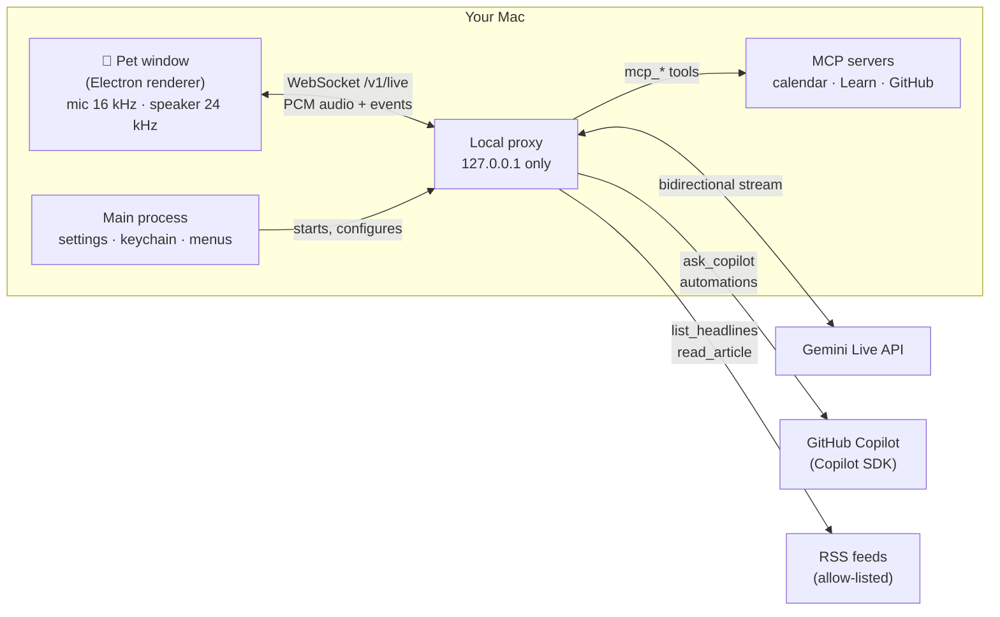

<div align="center">


# Tonarin

**The one next to you.** A voice desk companion for macOS that talks with you in real time,<br/>
and hands the careful thinking to GitHub Copilot.

[](https://github.com/himiyosh/tonarin/actions/workflows/ci.yml)


[](LICENSE)

English | [日本語](README.ja.md)

</div>

---

Tonarin (となりん, "the one next to you") is a small character that lives on your desktop. You talk to it the way
you would talk to a colleague at the next desk: it answers in about a second with **Gemini Live**, and when a question
needs real thought (an article, a design decision, how some code works) it asks **GitHub Copilot**, on the plan you
already have, and tells you the answer in its own words.

## Contents

- [Why Tonarin](#why-tonarin)
- [Features](#features)
- [Quick start](#quick-start)
- [Using Tonarin](#using-tonarin)
- [How it works](#how-it-works)
- [Privacy and security](#privacy-and-security)
- [Costs](#costs)
- [Configuration](#configuration)
- [Development](#development)
- [Contributing](#contributing)
- [Limitations](#limitations)
- [License](#license)

## Why Tonarin

| | |
|---|---|
| 🗣️ **Real-time voice** | Speak naturally and interrupt at any time. First audio usually arrives in about 1 second. |
| 🧠 **Copilot as the brain** | Deep dives go to GitHub Copilot through the official SDK, using the Copilot plan you already pay for. |
| 🐾 **Lives on your desk** | A small, always-on-top character with a speech bubble, not another chat window. |
| 🔒 **Private by design** | Keys stay in the macOS keychain, the local proxy only listens on 127.0.0.1, and nothing you say is logged. |

## Features

| Area | What you get |
|---|---|
| **Conversation** | Real-time voice with Gemini Live, barge-in, captions of both sides, Japanese and English (UI and speech are set separately). |
| **Copilot deep dives** | `ask_copilot` hands articles, comparisons, explanations and design questions to a sandboxed Copilot session. |
| **Tech news** | Headlines from 12 curated RSS feeds (Japanese and English). The pet introduces them and Copilot reads the full article when you want more. |
| **Reminders and automations** | "Remind me in 20 minutes", a morning briefing, scheduled Copilot research, break nudges and keyword watch, with a history you can review. |
| **Connected apps (MCP)** | Model Context Protocol servers become the pet's tools: your Mac's calendar (Google, iCloud, Exchange), Microsoft Learn, and GitHub (read-only, with **Sign in with GitHub**). |
| **Noise filter** | Only voice-like sound reaches Gemini, so typing, fans or a door do not start a conversation. Three levels. |
| **Usage and cost** | A settings page that shows what the paid tier would bill, today's usage and an estimate. |
| **Characters** | 8 original characters, sizes from 50% to 200%, and support for Codex / ChatGPT pet spritesheets. |
| **Mac-native touches** | Menu bar icon, Liquid Glass app icon on macOS 26, sleeps with your screen lock, and the bubble opens on whichever side of the pet has room. |

## Quick start

### Requirements

| | |
|---|---|
| **Mac** | Apple Silicon. Developed and tested on macOS 26. |
| **Gemini API key** | Free from [Google AI Studio](https://aistudio.google.com/apikey). The free tier works (see [Costs](#costs)). |
| **GitHub Copilot** *(optional)* | Any plan. Sign in once with the [Copilot CLI](https://github.com/github/copilot-cli), or set `COPILOT_GITHUB_TOKEN`. Without it, Tonarin still talks, just without deep dives. |
| **Node.js** | 22.12 or later, to build from source. |

### Build and run

```bash
git clone https://github.com/himiyosh/tonarin.git
cd tonarin
npm install
npm run pet          # run from source
# or
npm run dist         # build release/Tonarin-<version>-arm64.dmg
```

On first launch the settings window opens at **Connection**. Paste your Gemini API key and the pet wakes up.

> [!NOTE]
> Builds are ad hoc signed until a Developer ID is set up. The first time, open the app with right-click → **Open**.
> macOS asks for microphone access, and the first time the pet reads your calendar it asks for calendar access too.

## Using Tonarin

| Action | Result |
|---|---|
| **Talk** | Just speak. Ask about anything, or say "what's new in tech?" |
| **Click** | Mute or unmute the microphone (muting closes the mic, so the macOS mic indicator goes off). Wakes the pet when it is asleep. |
| **Drag** | Move the pet anywhere, up to the top of the screen. |
| **Right-click**, **Control-click** or **press and hold** | Menu: sleep, mute, character, size, reset the conversation, settings, quit. |
| **Pinch** (or Control + scroll) | Resize the pet. |

Things to try:

- "Remind me to stretch in 30 minutes."
- "What's on my calendar this afternoon?"
- "Pick an interesting AI story from today's news and ask Copilot what it means for developers."
- "Search Microsoft Learn for the default timeout of Azure Functions."

The pet naps after 10 quiet minutes (configurable) and whenever the screen is locked: the microphone and the
connection are closed until you click it.

## How it works



- **Pet window** (`pet/ui/`): captures the microphone, runs the [noise filter](pet/ui/speech-gate.js), plays audio,
  draws the character and the speech bubble.
- **Main process** (`pet/main.cjs`): settings, the keychain, the menu bar, window layout, Sign in with GitHub, and
  the bundled proxy's lifecycle.
- **Proxy** (`src/`): relays audio to Gemini Live, runs the tools (news, reminders, automations, MCP), and keeps a
  dedicated Copilot session for deep dives. It is also an OpenAI-compatible endpoint, which is how the project
  started (see [Configuration](docs/configuration.md#openai-compatible-endpoint)).

## Privacy and security

- **Keys stay local.** The Gemini key, MCP tokens and the GitHub sign-in are encrypted with Electron `safeStorage`
  (the macOS keychain). Pages never receive them.
- **Local-only proxy.** It binds to `127.0.0.1`, requires a bearer key, and rejects WebSocket connections from web pages.
- **Copilot is sandboxed.** Only Tonarin's own read-only tools are exposed; built-in shell, file and URL tools are
  disabled, the working folder is an empty temp folder, and Copilot Memory is off.
- **Untrusted content is data.** News articles and MCP results are labeled as data, not instructions, and capped in size.
  Articles are fetched only from allow-listed hosts.
- **Consent for changes.** Connected-app tools that create, change or delete are off by default, and the pet asks
  before using one.
- **Nothing you say is logged.** Logs hold app events and token counts only, never transcripts or audio.
- **Sign in with GitHub** uses the OAuth device flow with a public client ID and no client secret. Tokens expire
  after 8 hours and are renewed automatically. Access is read-only.

> [!IMPORTANT]
> On the Gemini **free tier**, Google may use what you send to improve its products, and human reviewers may read it.
> Keep conversations and connected apps free of confidential or personal data, or use the paid tier.

See [SECURITY.md](SECURITY.md) to report a vulnerability.

## Costs

| | Free tier | Paid tier |
|---|---|---|
| **Gemini Live** | No charge. Requests stop with an error at the limit. | Billed per token. A short exchange is about **$0.003**. |
| **Copilot** | Uses your Copilot plan's AI Credits, only when the pet asks Copilot or runs a Copilot automation. | Same |

What the paid tier bills, and how Tonarin keeps it low:

- Every turn is billed for the whole conversation so far, so the context is compacted at 25K tokens.
- Listening time can be billed on Gemini 3.8 Live. The noise filter sends audio only while someone is speaking,
  muting closes the mic, and naps or a locked screen close the connection.
- **Settings → Usage and cost** shows today's counts and a low-to-high estimate. Your bill is in AI Studio.

## Configuration

Everything a user needs is in the settings window (menu bar icon, right-click → Settings, or <kbd>⌘</kbd> <kbd>,</kbd>):
general, character, conversation and voice, automations, connected apps, news, connection, usage and cost.
Settings are stored in `~/Library/Application Support/Tonarin/`.

Environment variables for development and for the standalone proxy are listed in
[docs/configuration.md](docs/configuration.md).

## Development

| Command | What it does |
|---|---|
| `npm run pet` | Run the pet from source (starts the proxy with `tsx`) |
| `npm run pet:bundled` | Run with the bundled proxy, like the packaged app |
| `npm run dist` | Build the `.app`, `.zip` and `.dmg` into `release/` |
| `npm run typecheck` | TypeScript check |
| `npm test` | Unit tests (`node:test`) |
| `npm run live:check -- "prompt"` | Mic-less smoke test against Gemini Live |
| `npm run icon` | Rebuild the Liquid Glass icon (needs Xcode 26+) |
| `npm run hooks` | Enable the repo's Git hooks (blocks direct pushes to `main`) |

```text
tonarin/
├── pet/            Electron app: main process, preload, settings, layout, GitHub sign-in
│   └── ui/         Pet and settings pages, audio worklets, noise filter, characters
├── src/            Local proxy: Gemini Live relay, Copilot, news, reminders, automations, MCP, usage
├── scripts/        Build, packaging, icon and smoke-test scripts
├── assets/ build/  App and tray icons, Liquid Glass icon, entitlements, Info.plist strings
├── tests/          Unit tests
└── docs/           Configuration reference
```

## Contributing

Contributions are welcome. `main` only receives pull requests from `develop`; day-to-day work goes to feature
branches that merge into `develop`. See [CONTRIBUTING.md](CONTRIBUTING.md) for the branch model, commit style and
checklist.

## Limitations

- macOS on Apple Silicon only for now.
- Not notarized yet (needs a Developer ID).
- On some macOS 26 trackpads, a two-finger click right after a normal click arrives as a left click in every app.
  Use press-and-hold or Control-click to open the menu then.
- Gemini Live sessions have a limited lifetime. Tonarin resumes them when it can, but after a nap the conversation
  starts fresh.

## License

[MIT](LICENSE) © himiyosh

Characters in `pet/ui/characters/` are original artwork made for this project. Codex / ChatGPT pets are read from
your own `~/.codex/pets` folder and are never copied into the app or this repository.
